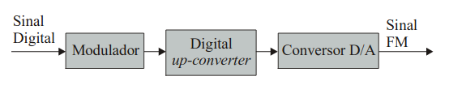

# FM Transmitter

This project aims to create an FM transmitter using just an FPGA.

- **Current Documentations**:
  - [CORDIC](docs/cordic.md)

# Goal

Build an FPGA-based Fully Digital FM Transmitter, i.e. create an FM
transmitter just using an FPGA and everything that an FPGA can get.

## Block Diagram

# Milestones

- [x] Blink led to test the Neek10 board
- [x] Add CI
- [x] Audio Loopback using data with sample rate of 48kHz
- [x] Create test environment and add on CI
- [x] Create and test sample interpolators to increase fs throughout the DUC (digital up-converter) chain, search for Comb filters
- [x] Create and test the frequency shifter to the DUC chain (search for
  CORDIC).
  - [x] Implement and test a CORDIC algorithm
  - [x] Make sure it is possible to shift in frequency complex signals
- [x] Create and test an HPSDM (High-Pass Sigma-Delta Modulator)
- [ ] Create and test an FM modulator in medium fs
- [ ] Create and test a DUC chain using the developed modules
- [ ] Test the FM transmitter on-board.

# Current Code's Features

- [x] Lint CI for Verilog
- [x] Makefile with
  - [x] Lint
  - [x] Test using [Pytest](https://docs.pytest.org/en/stable/) +
    [Cocotb](https://github.com/cocotb/cocotb) (also,
    [Cocotb-test](https://github.com/themperek/cocotb-test))
  - [x] Compile code using quartus platform
  - [x] Find and Program the Neek10 board, if attached on the computer
- [x] Loopback using (Board sanity-check):
  - [x] Onboarded Mic, which uses the ADC port for Max10 ADC protocol
  - [x] Line out of Onboarded CODEC IC [TLV320AIC3254](https://www.ti.com/lit/ds/symlink/tlv320aic3254.pdf?ts=1608386796342)
  - [x] Sample rate 48kHz
  - [x] Led meter to inform the audio energy
- [x] Sdr Tools
  - [x] Cic interpolator
  - [x] Up-converter
  - [ ] FM modulator
- [ ] AD $\Sigma\Delta$ modulator
- [x] DA $\Sigma\Delta$ modulator

# Aiming New Features

- [ ] Use an LPSDM (Low-Pass Sigma-Delta Modulator) instead of using the built-in ADC from Max10.

# Testing

Currently, there is lint and unit testing, meaning `unit testing` as
test benches for each module implemented on the code.

## Unit testing

For the tests, it has been used python, using Cocotb + Pytest to perform
the test benches.

It allows:

- Perform multiple types of tests using the same device
- Perform parametrized tests
- Test multiple devices separated
- Make assertions throughout the tests
- Save result files (as FFT, raw signal, etc)

Currently, there are tests for:

- [x] [mocked max10](src/max10.v) ([test file](tests/test_max10.py))
  - Mocked test file
- [x] [reset_delay](src/utils/reset_delay.v) ([test file](tests/test_reset_delay.py))
  - Test if the parameter delay applies the correct delay
  - Assert if it is working
- [x] [sign_extend](src/utils/sign_extend.v) ([test file](tests/test_sign_extend.py))
  - Assert if it extends the signal of a set of values
  - Includes generated random values
- [x] [cic_interpolator](src/sdr-tools/cic_interpolator.v) ([test file](tests/test_cic_interpolator.py))
  - Test a set of sinusoids as input within different values of `WIDTH`
    and data length
      - Assert if the output sinusoids are correctly interpolated
      - Assert the output signal frequency
      - Assert the SNR for signals below $\frac{3}{4}\cdot \frac{fs}{2}$
      are greater than 30dB
      - Save input and output results, including the FFTs
  - Test the impulsive response of the Cic implemented
    - Using 32-bit WIDTH
    - Save impulse response output, raw and FFT
  - FFT setup using _hanning_ window to smooth side-lobes
- [x] [cordic](src/sdr-tools/cordic.v)
  - Test random complex input values (100 for each testcase) with random
    values and angles, including random rotational angles.
      - Assert whether the pipeline has the actual depth
      - Assert the circular rotation mode is working with the expected
        values, checking if the data was precise, error value less than
        5.
      - Assert the circular vectoring mode is working with the same
        approach.
- [x] [hpdsm](src/delta-sigma/hpdsm.v)
  - Test input sinusoids with different widths and frequencies
    - Assert whether the output contains the sinusoid
    - Check if around the pass-band the noise is low
